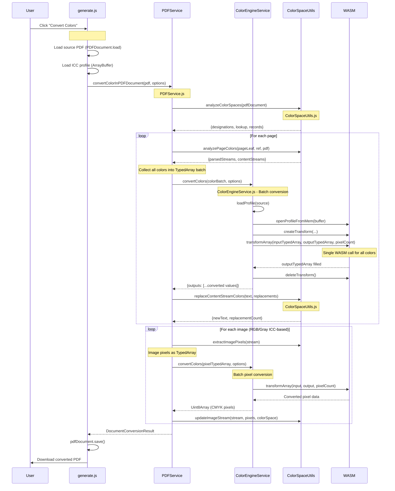
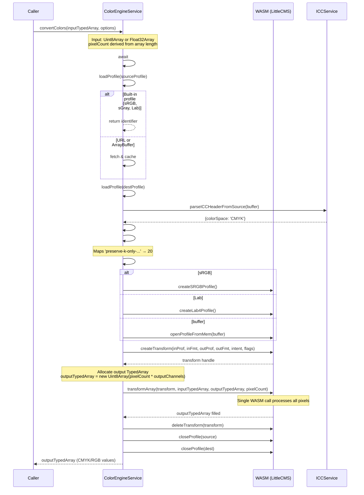
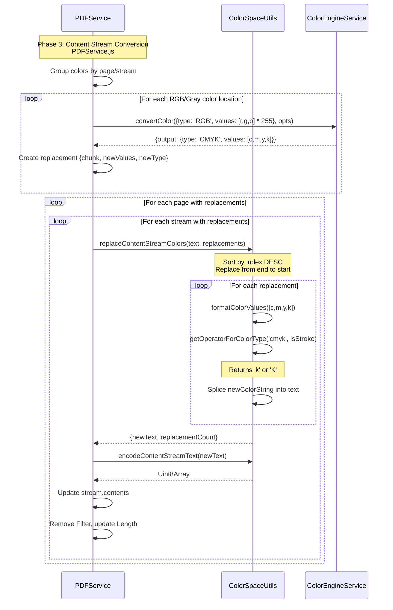

# Color Engine Integration Notes

**Project:** ConRes PDF Test Form Generator  
**Purpose:** Developer reference for the Color Engine integration  
**Last Updated:** 2025-12-18 (Session 15 - Lab Detection Fix & Acrobat Crash Fix)

---

## Quick Reference

### Development Commands

```bash
# Install dependencies
yarn install

# Start local dev server (port 80)
yarn local

# Start test server (port 8080)
yarn local:test

# Run all tests (auto-starts server on 8080)
yarn test

# Run tests via node directly
node testing/iso/ptf/2025/tests/run-tests.js

# Run specific test file
yarn test testing/iso/ptf/2025/tests/PDFService.test.js
yarn test testing/iso/ptf/2025/tests/ColorEngineService.test.js
yarn test testing/iso/ptf/2025/tests/ColorSpaceUtils.test.js
yarn test testing/iso/ptf/2025/tests/WorkflowIntegration.test.js
```

### Test Results (50 tests passing)

| Test File                   | Tests | Duration |
| --------------------------- | ----- | -------- |
| ColorEngineService.test.js  | 16    | ~1.1s    |
| ColorSpaceUtils.test.js     | 15    | ~10.2s   |
| PDFService.test.js          | 7     | ~0.4s    |
| WorkflowIntegration.test.js | 12    | ~0.4s    |

---

## File Structure

```
testing/iso/ptf/2025/
├── generate.js                      # Main TestFormGenerator class
├── index.html                       # UI with color conversion fieldset
├── helpers.js                       # Utility functions
├── services/
│   ├── ColorEngineService.js        # WASM LittleCMS wrapper (465 lines)
│   ├── ColorSpaceUtils.js           # Color space analysis (1112 lines)
│   ├── PDFService.js                # PDF manipulation (1059 lines)
│   ├── ICCService.js                # ICC profile parsing
│   ├── GhostscriptService.js        # GhostScript WASM
│   ├── helpers/
│   │   └── pdf-lib.js               # pdf-lib utility helpers
│   └── legacy/
│       └── LegacyPDFService.js      # Original verbose implementation
├── packages/
│   └── color-engine/
│       ├── src/index.js             # ColorEngine class (330 lines)
│       └── dist/color-engine.js     # WASM binary + glue code
└── tests/
    ├── ColorEngineService.test.js   # 16 tests
    ├── ColorSpaceUtils.test.js      # 15 tests
    ├── PDFService.test.js           # 7 tests
    ├── WorkflowIntegration.test.js  # 12 tests
    ├── fixtures/
    │   └── profiles/eciCMYK v2.icc
    ├── run-tests.js                 # Test runner
    └── playwright.config.js         # Playwright configuration
```

---

## Sequence Diagrams

### 1. TestFormGenerator Color Conversion Workflow

The main entry point for in-browser color conversion starts at [`generate.js#L289`](testing/iso/ptf/2025/generate.js#L289).



### 2. ColorEngineService Batch Color Conversion

Detailed flow for batch color conversion using TypedArrays at [`ColorEngineService.js`](testing/iso/ptf/2025/services/ColorEngineService.js).



**Note:** Single-color `convertColor()` still available for convenience, but batch operations are preferred for performance.

### 3. Content Stream Color Replacement

Flow for replacing colors in PDF content streams at [`PDFService.js#L408-516`](testing/iso/ptf/2025/services/PDFService.js#L408).



---

## Key Code Excerpts

### 1. TestFormGenerator Color Conversion Stage

**File:** [`generate.js#L289-416`](testing/iso/ptf/2025/generate.js#L289-L416)

```javascript
/**
 * In-browser color conversion stage using Color Engine
 * @param {TestFormGeneratorState} state
 */
async * #colorConversionStage(state) {
    state.stage = 'color-conversion';
    const fieldset = state.fieldsets['color-conversion-fieldset'];
    // ...

    convertButton.onclick = async () => {
        // Load the source PDF
        const sourceBuffer = await sourceFile.arrayBuffer();
        const pdfDocument = await PDFDocument.load(sourceBuffer);

        // Load the destination profile
        const profileBuffer = await profileFile.arrayBuffer();

        // Get rendering intent
        const renderingIntent = renderingIntentSelect?.value || 'relative-colorimetric';

        // Perform color conversion
        const conversionResult = await PDFService.convertColorInPDFDocument(pdfDocument, {
            destinationProfile: profileBuffer,
            renderingIntent,
            convertImages: true,
            convertContentStreams: true,
            updateBlendingSpace: true,
            verbose: true,
        });
        // ...
    };
}
```

### 2. PDFService.convertColorInPDFDocument

**File:** [`PDFService.js#L150-695`](testing/iso/ptf/2025/services/PDFService.js#L150-L695)

Key phases:

- **Phase 0** (L191-233): Locate ICC profiles and color space definitions
- **Phase 1** (L238-294): Locate XObject Image colors
- **Phase 2** (L296-406): Locate content stream colors and page resources
- **Phase 3** (L408-516): Convert content stream colors using ColorEngineService
- **Phase 3b** (L518-635): Convert image pixels

```javascript
static async convertColorInPDFDocument(pdfDocument, options) {
    const { destinationProfile, renderingIntent, convertImages, convertContentStreams } = options;

    // Analyze color spaces
    const analysisResult = analyzeColorSpaces(pdfDocument, { debug: verbose });

    // Phase 3: Convert content stream colors
    if (convertContentStreams && contentStreamColorLocations.length > 0) {
        const colorEngine = new ColorEngineService({ defaultRenderingIntent: renderingIntent });

        for (const location of contentStreamColorLocations) {
            if (location.colorType !== 'rgb' && location.colorType !== 'gray') continue;

            const result = await colorEngine.convertColor(
                { type: sourceType, values: inputValues },
                { sourceProfile: 'sRGB', destinationProfile, renderingIntent }
            );

            replacement = { chunk: location.chunk, newValues: result.output.values, newType: 'cmyk' };
        }

        // Apply replacements to streams
        for (const [pageRef, streamReplacements] of replacementsByPageAndStream) {
            const result = replaceContentStreamColors(parsedStream.text, replacements);
            stream.contents = encodeContentStreamText(result.newText);
        }
    }

    return { pagesProcessed, totalContentStreamConversions, totalImageConversions, ... };
}
```

### 3. ColorEngineService.convertColors (Batch)

**File:** [`ColorEngineService.js`](testing/iso/ptf/2025/services/ColorEngineService.js)

```javascript
/**
 * Convert multiple colors in a single WASM call
 * @param {Uint8Array|Float32Array} inputColors - Input color data as TypedArray
 * @param {object} options - Conversion options
 * @param {number} options.pixelCount - Number of pixels (derived from array length if omitted)
 * @returns {Promise<Uint8Array>} Output color data
 */
async convertColors(inputColors, options) {
    await this.#colorEngineReady;

    const sourceProfileSource = await this.loadProfile(options.sourceProfile);
    const destProfileSource = await this.loadProfile(options.destinationProfile);
    const outputType = this.#getOutputTypeForProfile(destProfileSource);

    const intent = this.#getRenderingIntentConstant(options.renderingIntent);
    const flags = useBPC ? LittleCMS.cmsFLAGS_BLACKPOINTCOMPENSATION : 0;

    const sourceProfile = this.#openProfile(sourceProfileSource);
    const destProfile = this.#openProfile(destProfileSource);

    const transform = colorEngine.createTransform(
        sourceProfile, inputFormat, destProfile, outputFormat, intent, flags
    );

    // Calculate pixel count from input array and channel count
    const pixelCount = options.pixelCount ?? inputColors.length / inputChannels;
    const outputColors = new Uint8Array(pixelCount * outputChannels);

    // Single WASM call for all pixels
    colorEngine.transformArray(transform, inputColors, outputColors, pixelCount);

    colorEngine.deleteTransform(transform);
    colorEngine.closeProfile(sourceProfile);
    colorEngine.closeProfile(destProfile);

    return outputColors;
}
```

### 4. replaceContentStreamColors

**File:** [`ColorSpaceUtils.js#L877-914`](testing/iso/ptf/2025/services/ColorSpaceUtils.js#L877-L914)

```javascript
export function replaceContentStreamColors(originalText, replacements) {
    // Sort by index descending to replace from end to start
    const sortedReplacements = [...replacements].sort((a, b) => b.chunk.index - a.chunk.index);

    let newText = originalText;

    for (const { chunk, newValues, newType } of sortedReplacements) {
        const isStroke = isStrokeOperator(chunk.operator ?? '');
        const newOperator = getOperatorForColorType(newType, isStroke);
        const newColorString = `${formatColorValues(newValues)} ${newOperator}`;

        // Splice in the replacement
        newText = before + newColorString + after;
    }

    return { originalText, newText, replacementCount };
}
```

### 5. WASM Color Engine K-Only GCR Intent

**File:** [`packages/color-engine/src/index.js#L307-310`](testing/iso/ptf/2025/packages/color-engine/src/index.js#L307-L310)

```javascript
// Custom intent: K-Only Black Point Compensation with GCR
// Guarantees neutral grays convert to K-only output
// Uses CMYK(0,0,0,100) as black reference instead of CMYK(100,100,100,100)
export const INTENT_PRESERVE_K_ONLY_RELATIVE_COLORIMETRIC_GCR = 20;
```

### 6. analyzeColorSpaces

**File:** [`ColorSpaceUtils.js#L248-318`](testing/iso/ptf/2025/services/ColorSpaceUtils.js#L248-L318)

```javascript
export function analyzeColorSpaces(pdfDocument, options = {}) {
    const uniqueColorSpaceRecords = new UniqueColorSpaceRecords(pdfDocument);
    const enumeratedIndirectObjects = pdfDocument.context.enumerateIndirectObjects();

    const colorSpaceDesignationTargetsByClassifier = {};
    const colorSpaceDesignationTargetsLookup = new Map();

    for (const [enumeratedRef, enumeratedObject] of enumeratedIndirectObjects) {
        if (enumeratedObject instanceof PDFRawStream) {
            const designation = processRawStreamColorSpace(enumeratedRef, enumeratedObject, uniqueColorSpaceRecords);
            // ... categorize by classifier
        } else if (enumeratedObject instanceof PDFPageLeaf) {
            const designation = processPageLeafColorSpaces(enumeratedRef, enumeratedObject, uniqueColorSpaceRecords);
            // ... categorize by classifier
        }
    }

    return { colorSpaceDesignationTargetsByClassifier, colorSpaceDesignationTargetsLookup, uniqueColorSpaceRecords };
}
```

### 7. Image Pixel Extraction and Conversion

**File:** [`ColorSpaceUtils.js#L1049-1085`](testing/iso/ptf/2025/services/ColorSpaceUtils.js#L1049-L1085) (extractImagePixels)  
**File:** [`ColorSpaceUtils.js#L1094-1111`](testing/iso/ptf/2025/services/ColorSpaceUtils.js#L1094-L1111) (updateImageStream)

```javascript
export function extractImagePixels(imageStream) {
    const metadata = extractImageMetadata(imageStream);

    // Only support uncompressed and FlateDecode for now
    if (metadata.filter && metadata.filter !== 'FlateDecode') {
        return null;
    }

    // Only support 8-bit images for now
    if (metadata.bitsPerComponent !== 8) {
        return null;
    }

    const decoded = decodePDFRawStream(imageStream);
    const pixels = decoded.decode();

    return { metadata, pixels, rawStream: imageStream };
}

export function updateImageStream(imageStream, newPixels, newColorSpace) {
    imageStream.contents = newPixels;
    const dict = imageStream.dict;
    dict.set(PDFName.of('ColorSpace'), newColorSpace);
    dict.delete(PDFName.of('Filter'));
    dict.delete(PDFName.of('DecodeParms'));
    dict.set(PDFName.of('Length'), dict.context.obj(newPixels.length));
}
```

---

## Rendering Intents

Available rendering intents in [`ColorEngineService.js#L457-464`](testing/iso/ptf/2025/services/ColorEngineService.js#L457-L464):

| Intent                                      | Value | Description                                                 |
| ------------------------------------------- | ----- | ----------------------------------------------------------- |
| `perceptual`                                | 0     | Perceptual - good for photographs                           |
| `relative-colorimetric`                     | 1     | Relative colorimetric - default                             |
| `saturation`                                | 2     | Saturation - good for graphics                              |
| `absolute-colorimetric`                     | 3     | Absolute colorimetric                                       |
| `preserve-k-only-relative-colorimetric-gcr` | 20    | K-Only GCR - ensures neutral grays convert to K-only output |

---

## Known Issues & TODOs

### 1. Transparency Blending Space (Not Yet Implemented)

**File:** [`PDFService.js#L680-682`](testing/iso/ptf/2025/services/PDFService.js#L680-L682)

```javascript
// Update transparency blending spaces if requested
if (updateBlendingSpace) {
    // TODO: Implement blending space update based on destination profile
}
```

### 2. Batch Color Conversion (Design Intent)

**Status:** Design finalized, implementation pending

**Approach:** Use TypedArrays for efficient batch color conversion:

- Input: `Uint8Array` or `Float32Array` containing packed color values
- Output: `Uint8Array` with converted color values
- Single WASM `transformArray()` call per batch
- Critical for 1.5 GB PDFs with ~30 pages

See [Sequence Diagram 2](#2-colorengineservice-batch-color-conversion) for the intended flow.

### 3. Image Format Limitations

Current implementation only supports:

- 8-bit images
- FlateDecode compression (or uncompressed)

JPEG (DCTDecode) and other formats are skipped with warning.

### 4. Lab Color Encoding (PDF Spec Reference)

**Source:** ISO 32000-2, Section 8.6.5.4 "Lab colour spaces" and Section 8.9.5.2 "Decode arrays"

#### Lab Values in Content Streams

Content stream operators use **float values** directly:

- L*: 0 to 100
- a*: -100 to +100 (configurable via Range array)
- b*: -100 to +100 (configurable via Range array)

#### Lab Values in Image Streams

Image streams use **integer values** (8-bit or 16-bit) with Decode array mapping:

| Component | 8-bit Range | Decode Array | Float Range            |
| --------- | ----------- | ------------ | ---------------------- |
| L*        | 0-255       | [0, 100]     | 0 to 100               |
| a*        | 0-255       | [amin, amax] | -100 to +100 (default) |
| b*        | 0-255       | [bmin, bmax] | -100 to +100 (default) |

**PDF Decode Formula:**

```
y = Dmin + (x × (Dmax - Dmin) / (2^n - 1))
```

For 8-bit Lab with default decode `[0 100 -100 100 -100 100]`:

- L*: `value / 255 * 100`
- a*: `(value / 255 * 200) - 100`
- b*: `(value / 255 * 200) - 100`

#### ICC Profile Lab Encoding (LittleCMS)

LittleCMS uses **ICC v4 Lab encoding**, which differs from PDF's Decode approach:

**8-bit (TYPE_Lab_8):**

```javascript
// Encode: Lab float → Lab8
L_byte = Math.round(L * 255 / 100);
a_byte = Math.round(a + 127);  // a* of 0 → 127
b_byte = Math.round(b + 127);  // b* of 0 → 127

// Decode: Lab8 → Lab float
L = (L_byte / 255) * 100;
a = a_byte - 127;
b = b_byte - 127;
```

**16-bit (TYPE_Lab_16):**

```javascript
// Encode: Lab float → Lab16
L_word = Math.round(L * 655.35);
a_word = Math.round((a + 128) * 257);  // a* of 0 → 32896
b_word = Math.round((b + 128) * 257);  // b* of 0 → 32896

// Decode: Lab16 → Lab float
L = L_word / 655.35;
a = (a_word / 257) - 128;
b = (b_word / 257) - 128;
```

**Reference:** `comprehensive-k-only-diagnostic.js` lines 209, 399-403

#### LittleCMS vs JSColorEngine Scaling

From `comprehensive-k-only-diagnostic.js` and `color-engine-benchmark.js`:

| Engine           | 8-bit Input        | 16-bit Input        | Float Input               |
| ---------------- | ------------------ | ------------------- | ------------------------- |
| LittleCMS (WASM) | TYPE_*_8           | TYPE_*_16           | TYPE_*_FLT (limited)      |
| JSColorEngine    | dataFormat: 'int8' | dataFormat: 'int16' | dataFormat: 'objectFloat' |

**Key observations:**

1. **LittleCMS Float32 Lab transforms** have issues in WASM (TYPE_Lab_FLT corrupts output, TYPE_Lab_DBL fails to create transforms)
2. **Use 8-bit or 16-bit** Lab encoding for reliable transforms
3. **Both engines produce comparable results** when using matching data formats
4. **Performance**: JSColorEngine with LUT is faster than LittleCMS WASM for large batches (~8MP pixels)

#### Conversion Strategy

When converting Lab images from PDF:

1. **Extract** raw 8/16-bit values from image stream
2. **Apply PDF Decode array** to get Lab float values
3. **Re-encode to ICC format** before passing to LittleCMS
4. **Transform** via LittleCMS to destination color space
5. **Encode output** back to 8/16-bit for image stream

---

## Experiments Tools (`testing/iso/ptf/2025/experiments/`)

This section documents the CLI tools and experiments available for debugging and development.

### Working Tools

#### 1. `convert-pdf-color.js` - PDF Color Conversion & Extraction CLI

**Status:** ✅ Active (Content and image extraction working)

The main CLI tool for PDF color conversion and content/image extraction for debugging.

```bash
# Generate document structure analysis (.pdf.md file)
node testing/iso/ptf/2025/experiments/convert-pdf-color.js \
    "assets/testforms/2025-08-15 - ConRes - ISO PTF - CR1 - Interlaken Map.pdf" \
    --generate-document-structure

# Extract content streams (all pages combined, default)
node testing/iso/ptf/2025/experiments/convert-pdf-color.js \
    "assets/testforms/2025-08-15 - ConRes - ISO PTF - CR1 - Interlaken Map.pdf" \
    output/2025-12-17-XXX \
    --extract-content-streams-only

# Extract content streams (one PDF per page)
node testing/iso/ptf/2025/experiments/convert-pdf-color.js \
    "assets/testforms/2025-08-15 - ConRes - ISO PTF - CR1 - Interlaken Map.pdf" \
    output/2025-12-17-XXX \
    --extract-content-streams-only \
    --content-streams=pages

# Extract images (all pages combined)
node testing/iso/ptf/2025/experiments/convert-pdf-color.js \
    "assets/testforms/2025-08-15 - ConRes - ISO PTF - CR1 - Interlaken Map.pdf" \
    output/2025-12-17-XXX \
    --extract-images-only

# Extract images (one PDF per page)
node testing/iso/ptf/2025/experiments/convert-pdf-color.js \
    "assets/testforms/2025-08-15 - ConRes - ISO PTF - CR1 - Interlaken Map.pdf" \
    output/2025-12-17-XXX \
    --extract-images-only \
    --images=pages
```

**Key Options:**

| Option                           | Description                                       |
| -------------------------------- | ------------------------------------------------- |
| `--generate-document-structure`  | Generate `.pdf.md` file with color space analysis |
| `--extract-content-streams-only` | Extract content streams (removes images)          |
| `--extract-images-only`          | Extract images only (removes content)             |
| `--content-streams=combined`     | All pages in one PDF (default)                    |
| `--content-streams=pages`        | One PDF per page                                  |
| `--images=combined`              | All pages combined (default)                      |
| `--images=pages`                 | One PDF per page                                  |
| `--images=separate`              | One PDF per image                                 |
| `--verbose=1\|2\|3`              | Verbosity level                                   |

**Output Naming:**

- Content combined: `{output-dir}/- Contents.pdf`
- Content per-page: `{output-dir}/Page XX - Contents.pdf`
- Images combined: `{output-dir}/- Images.pdf`
- Images per-page: `{output-dir}/Page XX - Images.pdf`
- Images separate: `{output-dir}/Page XX - Image XXX.pdf`
- Document structure: `{input-file}.pdf.md`

#### 2. `validate-pdf.js` - PDF Validation CLI

**Status:** ✅ Working

Validates PDF color spaces and structure. Useful for verifying converted PDFs.

```bash
# Basic validation
node testing/iso/ptf/2025/experiments/validate-pdf.js output.pdf

# Expected color space validation
node testing/iso/ptf/2025/experiments/validate-pdf.js output.pdf \
    --expected-color-space=DeviceCMYK \
    --verbose

# Dump image and content metadata
node testing/iso/ptf/2025/experiments/validate-pdf.js output.pdf \
    --dump-images \
    --dump-content \
    --check-profiles
```

**Options:**

| Option                        | Description                          |
| ----------------------------- | ------------------------------------ |
| `--expected-profile=<name>`   | Expected output intent profile name  |
| `--expected-color-space=<cs>` | Expected primary color space         |
| `--verbose`                   | Enable verbose output                |
| `--dump-images`               | Dump image metadata                  |
| `--dump-content`              | Dump content stream color operations |
| `--check-profiles`            | Check ICC profile validity           |

#### 3. `extract-pdf-text.js` - PDF Text Extraction CLI

**Status:** ✅ Working

Extracts text content from PDFs. Handles UTF-16BE encoded strings (common in Acrobat-generated reports).

```bash
node testing/iso/ptf/2025/experiments/extract-pdf-text.js \
    "path/to/report.pdf"
```

#### 4. `color-engine-benchmark.js` - Performance Benchmark

**Status:** ⚠️ Working (requires `js-color-engine` package)

Quick performance comparison between WASM (LittleCMS) and JS color engines.

```bash
node testing/iso/ptf/2025/experiments/color-engine-benchmark.js
```

**Note:** Requires `packages/js-color-engine/` directory which may not be committed.

#### 5. `comprehensive-k-only-diagnostic.js` - K-Only GCR Diagnostic

**Status:** ⚠️ Working (requires `js-color-engine` package)

Tests gray levels across multiple ICC profiles to verify K-Only GCR behavior.

```bash
node testing/iso/ptf/2025/experiments/comprehensive-k-only-diagnostic.js
```

---

### Browser-Based Tools (Stale/Incomplete)

#### 6. `convert-color.html` - Browser Color Conversion

**Status:** ⛔ Stale - Uses services directly in browser

Browser-based color conversion demo. May not work with current service APIs.

#### 7. `embed-output-intent.html` - Output Intent Embedding

**Status:** ⛔ Stale - Uses services directly in browser

Browser-based output intent embedding. May not work with current service APIs.

#### 8. `decalibrate/decalibrate.js` - Decalibration Demo

**Status:** ⛔ Incomplete - `index.html` is empty

Browser module for testing decalibration. The HTML loader is not implemented.

---

### Internal/Debugging Scripts (`scripts/`)

Analysis and comparison scripts created during development sessions.

| Script                             | Purpose                                      |
| ---------------------------------- | -------------------------------------------- |
| `analyze-font-references.js`       | Compare font refs in content vs Resources    |
| `deep-font-analysis.js`            | CID font structure and embedding analysis    |
| `analyze-019-content.js`           | Content stream analysis for output 019       |
| `analyze-content-streams.js`       | Generic content stream analysis              |
| `analyze-source-content.js`        | Source PDF comparison                        |
| `compare-extraction-vs-acrobat.js` | Compare extraction against Acrobat reference |
| `generate-doc-structures.js`       | Batch document structure generation          |
| `validate-017.js` / `018` / `019`  | Session-specific validation scripts          |
| `test-image-extraction-fix.js`     | Image extraction testing                     |
| `test-images-per-page.js`          | Per-page image testing                       |

---

### Output Folder Convention

**IMPORTANT:** Never overwrite sequentially numbered output folders.

```
experiments/output/
├── 2025-12-17-001/     # First output of the day
├── 2025-12-17-002/     # Second output
├── ...
├── 2025-12-17-015/     # Can have suffixes like -pages
└── 2025-12-17-016/     # Most recent
```

**Rules:**

1. Always check for existing folders before creating a new one
2. Increment the sequence number (001, 002, etc.) for each new output
3. Suffixes like `-pages` are allowed for variants
4. Never modify or rename existing numbered folders programmatically

---

## PDF Extraction Tool - Technical Details

### Key Learnings (Session 8)

#### pdf-lib Content Stream Handling

1. **Always use indirect references for streams**:

   ```javascript
   // WRONG - causes PDF reader failures
   copiedPage.node.set(PDFName.of('Contents'), newDoc.context.flateStream(content));

   // CORRECT - register as indirect object first
   const stream = newDoc.context.flateStream(content);
   const ref = newDoc.context.register(stream);
   copiedPage.node.set(PDFName.of('Contents'), ref);
   ```

2. **q/Q graphics state operators must be balanced**:
   - Each `q` (save) needs matching `Q` (restore)
   - Greedy regex matching can leave orphaned operators
   - Empty `q...Q` blocks are harmless

3. **pdf-lib validation is not sufficient**:
   - `PDFDocument.load()` and `save()` succeeding doesn't guarantee valid PDF
   - Must test with actual PDF readers (Acrobat, Preview)

#### Content Stream Modification Pattern

When removing operations from PDF content streams:

```javascript
// DON'T try to match nested blocks with greedy regex
const badPattern = /q\s+[^Q]*\/Image\s+Do\s*Q/g;  // Leaves orphaned Q!

// DO remove only the specific operation
const goodPattern = /\/Image\s+Do\b/g;  // Preserves q/Q balance
```

---

## Resource Deduplication (Session 11)

For the target use case (1.5 GB PDFs with ~30 pages), efficient memory management is critical. The `ResourceDeduplicator` class provides hash-based tracking for cross-page resource sharing.

### ResourceDeduplicator Class

**File:** [`convert-pdf-color.js`](testing/iso/ptf/2025/experiments/convert-pdf-color.js)

```javascript
class ResourceDeduplicator {
    #hashToEntry = new Map();       // hash -> {ref, stream}
    #sourceToCanonical = new Map(); // sourceRef -> canonicalRef
    #streamHashCache = new WeakMap(); // stream -> hash (avoids rehashing)
    #targetDoc;

    constructor(targetDoc) {
        this.#targetDoc = targetDoc;
    }

    async getStreamHash(stream) {
        let hash = this.#streamHashCache.get(stream);
        if (!hash) {
            const decoded = decodePDFRawStream(stream).decode();
            hash = await computeHash(decoded);
            this.#streamHashCache.set(stream, hash);
        }
        return hash;
    }

    async register(stream, sourceRef = null) {
        const hash = await this.getStreamHash(stream);

        if (this.#hashToEntry.has(hash)) {
            const existing = this.#hashToEntry.get(hash);
            if (sourceRef) this.#sourceToCanonical.set(sourceRef, existing.ref);
            return { ref: existing.ref, isDuplicate: true };
        }

        const ref = this.#targetDoc.context.register(stream);
        this.#hashToEntry.set(hash, { ref, stream });
        if (sourceRef) this.#sourceToCanonical.set(sourceRef, ref);
        return { ref, isDuplicate: false };
    }

    getStats() {
        return {
            uniqueResources: this.#hashToEntry.size,
            totalRegistered: this.#sourceToCanonical.size,
            duplicatesAvoided: this.#sourceToCanonical.size - this.#hashToEntry.size,
        };
    }
}
```

### Key Features

| Feature                      | Description                                                     |
| ---------------------------- | --------------------------------------------------------------- |
| **SHA-256 Hashing**          | Uses `globalThis.crypto.subtle` for cross-runtime compatibility |
| **WeakMap Caching**          | Avoids rehashing the same stream multiple times                 |
| **Cross-page Deduplication** | Identical resources shared across pages                         |
| **Statistics Tracking**      | Reports unique vs duplicate resource counts                     |

### Usage Pattern

```javascript
const deduplicator = new ResourceDeduplicator(newDoc);

// Register a stream and get canonical reference
const { ref, isDuplicate } = await deduplicator.register(stream, sourceRef);

if (isDuplicate) {
    console.log('Reusing existing resource');
}

// Get deduplication statistics
const stats = deduplicator.getStats();
console.log(`Saved ${stats.duplicatesAvoided} duplicate objects`);
```

---

## Image Extraction (Session 11)

### Content Stream Filtering

The `keepOnlyImageDoOperations()` function filters content streams to retain only image-drawing operations.

**Algorithm:**

1. Parse content stream into tokens
2. Track `q`/`Q` graphics state blocks with nesting depth
3. Identify `Do` operations that reference image XObjects
4. Keep only `q`/`Q` blocks containing image `Do` operations
5. Preserve `cm` (transformation matrix) and `gs` (graphics state) operations

**Example:**

```
Input content stream:
  q
    0.5 0 0 0.5 100 200 cm    % Transformation matrix
    /Im0 Do                    % Image operation
  Q
  BT /F1 12 Tf (Text) Tj ET   % Text operation

Output content stream:
  q
    0.5 0 0 0.5 100 200 cm
    /Im0 Do
  Q
```

### Extraction Functions

| Function                      | Description                               |
| ----------------------------- | ----------------------------------------- |
| `extractImagesAllPages()`     | All pages combined → `- Images.pdf`       |
| `extractImagesPerPage()`      | One PDF per page → `Page XX - Images.pdf` |
| `keepOnlyImageDoOperations()` | Filter content to image ops only          |

### Validation Results (vs Acrobat Reference)

| Mode               | Our Output | Acrobat Ref | Difference |
| ------------------ | ---------- | ----------- | ---------- |
| Combined (3 pages) | 29.74 MB   | 29.27 MB    | +1.6%      |
| Per-page total     | 29.74 MB   | 29.59 MB    | +0.5%      |

Per-page breakdown:

| Page | Extraction | Acrobat Ref | Difference |
| ---- | ---------- | ----------- | ---------- |
| 01   | 6.74 MB    | 6.68 MB     | +0.8%      |
| 02   | 2.50 MB    | 2.45 MB     | +2.1%      |
| 03   | 20.51 MB   | 20.46 MB    | +0.3%      |

---

## Reference Files (Session 12)

**IMPORTANT:** Always use reference files from `testing/iso/ptf/2025/experiments/output/2025-12-17-Acrobat/`

### Source and Extraction References

| File                                                                                                | Purpose                                   |
| --------------------------------------------------------------------------------------------------- | ----------------------------------------- |
| `2025-08-15 - ConRes - ISO PTF - CR1 - Interlaken Map (2025-12-17-Acrobat).pdf`                     | Original 3-page source PDF                |
| `2025-08-15 - ConRes - ISO PTF - CR1 - Interlaken Map - Report (2025-12-17-Acrobat).txt`            | Acrobat Preflight validation report       |
| `2025-08-15 - ConRes - ISO PTF - CR1 - Interlaken Map - Contents (2025-12-17-Acrobat).pdf`          | Content streams only (Acrobat extraction) |
| `2025-08-15 - ConRes - ISO PTF - CR1 - Interlaken Map - Contents - Report (2025-12-17-Acrobat).txt` | Preflight report for contents             |
| `2025-08-15 - ConRes - ISO PTF - CR1 - Interlaken Map - Images (2025-12-17-Acrobat).pdf`            | Images only (Acrobat extraction)          |
| `2025-08-15 - ConRes - ISO PTF - CR1 - Interlaken Map - Images - Report (2025-12-17-Acrobat).txt`   | Preflight report for images               |

### Color Conversion References

| File                                                                                                   | Purpose                                     |
| ------------------------------------------------------------------------------------------------------ | ------------------------------------------- |
| `...Interlaken Map - eciCMYK v2 - Relative Colorimetric - LittleCMS (2025-12-17-Acrobat).pdf`          | Converted using LittleCMS engine in Acrobat |
| `...Interlaken Map - eciCMYK v2 - Relative Colorimetric - LittleCMS - Report (2025-12-17-Acrobat).txt` | Preflight report                            |
| `...Interlaken Map - eciCMYK v2 - Relative Colorimetric - Acrobat (2025-12-17-Acrobat).pdf`            | Converted using Acrobat's native engine     |
| `...Interlaken Map - eciCMYK v2 - Relative Colorimetric - Acrobat - Report (2025-12-17-Acrobat).txt`   | Preflight report                            |

These files serve as ground truth for validating our extraction and color conversion implementations.

---

## Known Issues (Session 12-13)

### 1. Fonts in Content Extraction

**Status:** ✅ Resolved (Session 13)

**Original issue:** Content extraction (016) was reported as "missing fonts."

**Session 13 analysis:** Deep font analysis revealed fonts ARE correctly embedded:

- All 13 fonts properly embedded with TrueType/Type1C data
- Font references correctly resolved in content streams
- Issue was misdiagnosed - fonts are working correctly

### 2. Images Not Rendering in Image Extraction

**Status:** ✅ Sufficient for color conversion

**Root cause:** Complex masks not fully replicated during extraction.

**Current state:**

- Images are intact and correctly embedded in the PDF
- Image data is preserved correctly for color comparison
- Visual rendering may be imperfect due to complex mask handling
- This is sufficient for the primary use case: comparing color values in converted outputs

**Fix applied (Session 12):** Updated `keepOnlyImageDoOperations()` to preserve clipping operations (`re`, `W`, `n`).

**Output:** `2025-12-17-019/`

### 3. Resource Deduplication

**Status:** ✅ Implemented (Session 13)

**Problem:** `copyPages()` created duplicate resources for each page, causing file bloat.

**Solution:** Added `deduplicateDocumentResources()` post-processing function:

- Stream deduplication: Hashes PDFRawStream objects, rewrites references to canonical copy
- Dictionary deduplication: Serializes Font/FontDescriptor dicts, merges duplicates

**Results comparison (Content extraction):**

| Metric         | Before (016) | After (021) | Acrobat Ref |
| -------------- | ------------ | ----------- | ----------- |
| FontDescriptor | 36           | **14**      | **14** ✓   |
| Type1C streams | 6            | **2**       | **2** ✓    |
| ICC Profiles   | 4            | **2**       | **2** ✓    |
| File Size      | 86.6 MB      | 86.2 MB     | 84 MB       |

**Output:** `2025-12-17-021/`

---

## Color Conversion Status (Session 16)

### Current Status: ✅ RGB/Gray/Lab → CMYK Verified

Full document color conversion with Lab support:

- **Output:** `2025-12-18-014/2025-08-15 - ConRes - ISO PTF - CR1 - Interlaken Map - eciCMYK v2 - Relative Colorimetric (2025-12-18-014).pdf`
- **Pages 1-2:** Converted to DeviceCMYK (using direct `k` operator)
- **Page 3:** Lab colors converted to DeviceCMYK (4096 content stream + 3 images)
- **File Size:** 1005 MB (uncompressed streams, CMYK has 4 components vs Lab's 3)
- **Verified:** Opens correctly in both Acrobat and Preview

### Session 16 Implementation

1. **Lab Content Stream Conversion** - `PDFService.js`
   - Lab colors detected via `colorSpaceType === 'Lab'` in pageColorSpaceDefinitions
   - Lab parameters (Range) extracted from color space definition
   - PDF Lab values converted to ICC Lab encoding before passing to LittleCMS
   - Uses built-in 'Lab' profile (D50 whitepoint)

2. **Lab Image Conversion** - `PDFService.js`
   - Lab images detected by colorSpaceType (not ICC profile)
   - Lab parameters extracted via `UniqueColorSpaceRecords.createColorSpaceDefinitionFrom()`
   - 16-bit to 8-bit conversion added (Lab images were 16-bit per component)
   - Range mapping handles non-standard PDF Lab ranges

3. **ColorSpaceUtils Enhancement** - `ColorSpaceUtils.js`
   - Added `LabColorSpaceDefinition` type with WhitePoint, BlackPoint, Range
   - `createColorSpaceDefinitionFrom()` now extracts Lab parameters
   - `extractImagePixels()` now supports 16-bit images (converts to 8-bit)
   - `updateImageStream()` now sets BitsPerComponent (fixes 16-bit→8-bit conversion)
   - `updateImageStream()` now supports optional FlateDecode compression

4. **FlateDecode Compression** - `ColorSpaceUtils.js`
   - Added `compressWithFlateDecode()` helper using Node.js zlib (`deflateSync`, not `deflateRawSync`)
   - `compressImages` option added to `convertColorInPDFDocument()`
   - Output 2025-12-18-016: 1005 MB → 378 MB (62% reduction)
   - Verified in Acrobat

### Remaining Work

- **K-Only GCR intent:** Ready to implement now that Relative Colorimetric is verified

---

## Lab Color Space Implementation Details

### PDF Lab Encoding (ISO 32000-2, Section 8.6.5.4)

PDF Lab color space format:

```
[/Lab << /WhitePoint [Xw Yw Zw] /BlackPoint [Xb Yb Zb] /Range [amin amax bmin bmax] >>]
```

- **WhitePoint:** Required. D50 `[0.9642 1 0.8249]` or D65 `[0.9505 1 1.089]`
- **BlackPoint:** Optional. Default `[0 0 0]`
- **Range:** Optional. Default `[-100 100 -100 100]` for a*/b*

### Lab Value Conversion (PDF → ICC Lab)

PDF encodes Lab values differently from ICC Lab. Our test PDF uses Range `[-128 127 -128 127]`:

```javascript
// Content stream values: L* [0-100], a*/b* [-128 to +127]
// When Range is [-128, 127]: values are already in ICC Lab encoding
// When Range differs: convert using:
//   icc_a = (pdf_a - amin) / (amax - amin) * 255 - 128
//   icc_b = (pdf_b - bmin) / (bmax - bmin) * 255 - 128
```

### 16-bit Image Handling

Lab images in the test PDF are 16-bit per component. Conversion:

```javascript
// PDF 16-bit is big-endian: high byte first
// Convert to 8-bit by taking high byte
pixels8bit[i] = rawPixels16bit[i * 2];
```

---

## Next Phase: Verification & K-Only GCR

### Primary Focus

Verify Lab conversion output in Acrobat, then implement K-Only GCR intent.

### Reference Files

- **Acrobat** - `...eciCMYK v2 - Relative Colorimetric - Acrobat.pdf`
- **Color Translator (LittleCMS)** - `...eciCMYK v2 - Relative Colorimetric - LittleCMS.pdf`

**LittleCMS reference:** Confirmed to use Relative Colorimetric **without** Black Point Compensation.

### Output Naming Convention

**Format:** `<original-filename> - <conversion-suffix> (YYYY-MM-DD-XXX).<ext>`

| Extraction Type | Output File                                                                                                                 |
| --------------- | --------------------------------------------------------------------------------------------------------------------------- |
| Full document   | `2025-08-15 - ConRes - ISO PTF - CR1 - Interlaken Map - eciCMYK v2 - Relative Colorimetric (2025-12-18-XXX).pdf`            |
| Images only     | `2025-08-15 - ConRes - ISO PTF - CR1 - Interlaken Map - Images - eciCMYK v2 - Relative Colorimetric (2025-12-18-XXX).pdf`   |
| Contents only   | `2025-08-15 - ConRes - ISO PTF - CR1 - Interlaken Map - Contents - eciCMYK v2 - Relative Colorimetric (2025-12-18-XXX).pdf` |

### ICC Profile

Use `fixtures/profiles/eciCMYK v2.icc` as the destination profile.

### Comparison Strategy

1. Convert full document, images, and contents separately
2. Compare against Acrobat and LittleCMS reference files in `output/2025-12-17-Acrobat/`
3. Validate color values match expected transformations

### Future Work

After Relative Colorimetric is producing consistent results:

- Implement K-Only Black/GCR custom intent
- Other standard rendering intents (Perceptual, Saturation, Absolute Colorimetric)

---

## Related Documentation

- [2025-12-01-Color-Engine-Integration-Progress.md](2025-12-01-Color-Engine-Integration-Progress.md) - Phase tracking and detailed progress
- [2025-12-01-Convert-PDF-Colors-Progress.md](2025-12-01-Convert-PDF-Colors-Progress.md) - PDF extraction tool progress
- [2025-12-01-Color-Engine-API-Reference.md](2025-12-01-Color-Engine-API-Reference.md) - Color Engine API reference
- [CLAUDE.md](CLAUDE.md) - Development guidelines
- [testing/iso/ptf/README.md](testing/iso/ptf/README.md) - PTF-specific documentation
