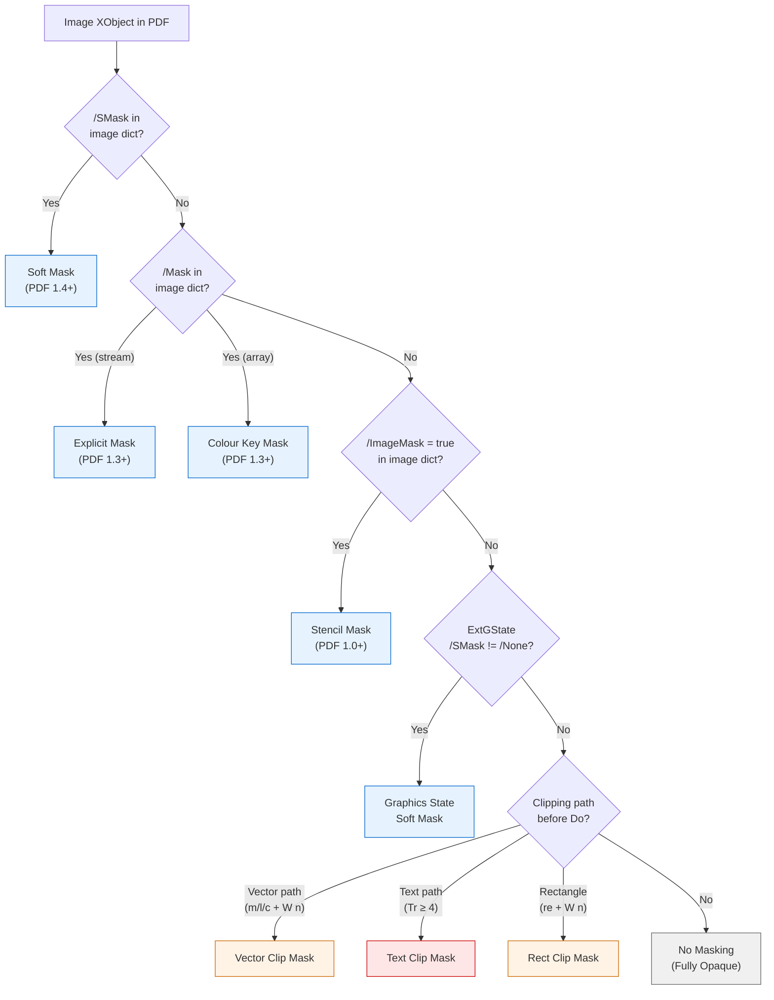
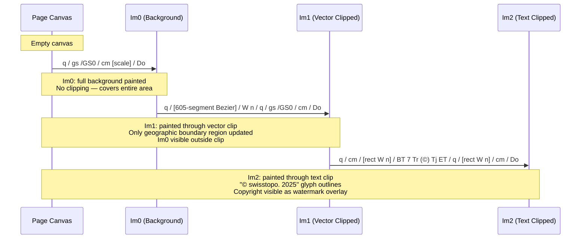
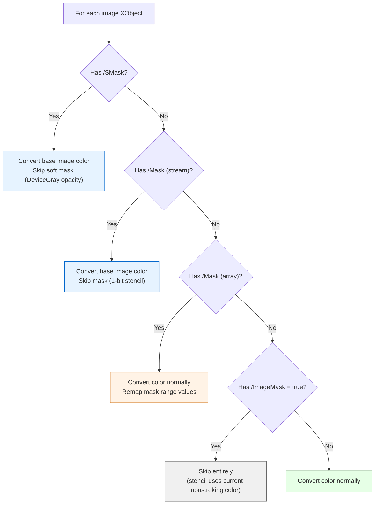

# PDF Image Masking Mechanisms: Analysis Report

**Date:** 2026-02-12
**Author:** Saleh Abdel Motaal
**Scope:** Image masking detection and behavior in ConRes ISO PTF test form PDFs
**Reference Specification:** ISO 32000-2 (PDF 2.0)

---

## 1. Overview

This report documents every masking mechanism found across six ConRes ISO PTF test form PDFs.
The analysis covers all five mechanisms by which a PDF can visually mask an image: four defined
in image dictionaries, and one achieved through content stream clipping operators (including
text rendering mode 7).

### 1.1 Summary of All Masking Findings

| PDF File                      | Pages | Images | Masks Found                                                   |
| ----------------------------- | ----- | ------ | ------------------------------------------------------------- |
| **F-01 Fixtures (16-bit)**    | 1     | 9      | 6 masked: 3 vector clips, 3 text clips (Tr 7), 6 rect clips   |
| **F-01 Fixtures (8-bit)**     | 1     | 9      | 6 masked: identical structure to 16-bit (BPC=8 instead of 16) |
| **ISO PTF 2x-4x**             | 20    | 92     | 6 masked: `/SMask` dictionary soft masks on pages 12-15       |
| **Interlaken Map (original)** | 3     | 9      | None                                                          |
| **Type Sizes and Lissajou**   | 4     | 0      | N/A (no images; vector/text only)                             |
| **Full CR1**                  | 28    | 112    | None                                                          |

### 1.2 Masking Mechanisms Found in These PDFs

| Mechanism                               | Where Found                 | Images Affected | Detection Method         |
| --------------------------------------- | --------------------------- | --------------- | ------------------------ |
| **Vector clipping path** (Bezier `W n`) | F-01 Fixtures (both)        | Im1, Im4, Im7   | Content stream analysis  |
| **Text clipping path** (Tr 7)           | F-01 Fixtures (both)        | Im2, Im5, Im8   | Content stream analysis  |
| **Rectangular clip** (re `W n`)         | F-01 Fixtures (both)        | Im2, Im5, Im8   | Content stream analysis  |
| **Soft mask** (`/SMask` in image dict)  | ISO PTF 2x-4x (pages 12-15) | 6 images        | Image dictionary inspect |

### 1.3 Masking Mechanism Decision Flow



---

## 2. PDF Masking Mechanisms (Specification Reference)

The PDF specification defines four dictionary-based masking mechanisms for images, plus a
content stream technique using clipping operators. Within clipping, text rendering modes 4-7
add a further dimension.

### 2.1 Stencil Masking (`/ImageMask = true`)

A monochrome 1-bit image where samples designate opaque/transparent regions rather than colors.

| Property              | Value                                                               |
| --------------------- | ------------------------------------------------------------------- |
| **Dictionary entry**  | `/ImageMask true`                                                   |
| **BitsPerComponent**  | Must be 1                                                           |
| **ColorSpace**        | Must be absent                                                      |
| **Painting behavior** | Sample 0 paints current nonstroking color; sample 1 leaves backdrop |
| **PDF version**       | PDF 1.0+                                                            |
| **Found in**          | None of the analyzed PDFs                                           |

> "An image mask (an image XObject whose ImageMask entry is true) is a monochrome image in which
> each sample is specified by a single bit. However, instead of being painted in opaque black and white,
> the image mask is treated as a stencil mask that is partly opaque and partly transparent."
>
> --- ISO 32000-2, Section 8.9.6.2

### 2.2 Explicit Masking (`/Mask` as stream)

A separate image XObject used as a binary mask for a base image.

| Property             | Value                                                              |
| -------------------- | ------------------------------------------------------------------ |
| **Dictionary entry** | `/Mask` (stream reference to image XObject with `/ImageMask true`) |
| **Relationship**     | Mask image controls which pixels of base image are painted         |
| **Resolution**       | Mask and base image may differ in resolution                       |
| **Alignment**        | Both mapped to unit square; boundaries coincide on page            |
| **PDF version**      | PDF 1.3+                                                           |
| **Found in**         | None of the analyzed PDFs                                          |

> "The base image and the image mask need not have the same resolution (Width and Height values),
> but since all images shall be defined on the unit square in user space, their boundaries on the page will
> coincide; that is, they will overlay each other."
>
> --- ISO 32000-2, Section 8.9.6.3

### 2.3 Colour Key Masking (`/Mask` as array)

A range of color values treated as transparent.

| Property             | Value                                                            |
| -------------------- | ---------------------------------------------------------------- |
| **Dictionary entry** | `/Mask` (array of `2 x n` integers: `[min1 max1 ... minn maxn]`) |
| **Behavior**         | Samples with all components within ranges are not painted        |
| **Values**           | Pre-decode component values (0 to 2^BPC - 1)                     |
| **PDF version**      | PDF 1.3+                                                         |
| **Found in**         | None of the analyzed PDFs                                        |

> "An image sample shall be masked (not painted) if all of its colour components before decoding,
> c1...cn, fall within the specified ranges."
>
> --- ISO 32000-2, Section 8.9.6.4

### 2.4 Soft Masking (`/SMask` as stream)

A subsidiary image defining per-pixel opacity or shape values (the transparency model).

| Property             | Value                                                           |
| -------------------- | --------------------------------------------------------------- |
| **Dictionary entry** | `/SMask` (stream reference to soft-mask image)                  |
| **Mask color space** | Must be DeviceGray                                              |
| **Behavior**         | Defines continuous opacity 0.0-1.0 at each pixel                |
| **Override**         | Overrides current soft mask in graphics state and `/Mask` entry |
| **PDF version**      | PDF 1.4+                                                        |
| **Found in**         | ISO PTF 2x-4x, pages 12-15                                      |

> "A subsidiary image XObject defining a soft-mask image [...] shall be used as a source of mask shape
> or mask opacity values in the transparent imaging model. [...] If present, this entry shall override the
> current soft mask in the graphics state, as well as the image's Mask entry, if any."
>
> --- ISO 32000-2, Section 8.9.5 (Table 87)

### 2.5 Vector Clipping Path Masking (Content Stream Technique)

Uses path construction operators combined with the clipping operator `W` or `W*` to restrict
the painting region. This is a content stream technique, not a dictionary mechanism.

| Property             | Value                                                       |
| -------------------- | ----------------------------------------------------------- |
| **Dictionary entry** | None                                                        |
| **Operators**        | Path construction (`m`, `l`, `c`, `re`) + `W`/`W*` + `n`    |
| **Behavior**         | Subsequent painting operations restricted to clipped region |
| **Scope**            | Active until graphics state is restored with `Q`            |
| **PDF version**      | PDF 1.0+                                                    |
| **Found in**         | F-01 Fixtures (both 16-bit and 8-bit)                       |

> "Earlier versions of PDF commonly simulated masking by defining a clipping path enclosing only
> those of an image's samples that are to be painted. However, if the clipping path is very complex (or if
> there is more than one clipping path) not all interactive PDF processors will render the results in the
> same way."
>
> --- ISO 32000-2, Section 8.9.6.1, NOTE

### 2.6 Text Clipping Path Masking (Text Rendering Mode 4-7)

Text rendering modes 4 through 7 add glyph outlines to the current clipping path. Mode 7
("clip only, invisible") is used in F-01 for the copyright watermark.

| Mode  | Description                          | Visual Effect                           |
| ----- | ------------------------------------ | --------------------------------------- |
| 0     | Fill text                            | Normal text rendering                   |
| 1     | Stroke text                          | Outlined text                           |
| 2     | Fill, then stroke text               | Filled + outlined                       |
| 3     | Neither fill nor stroke (invisible)  | Text is invisible, no clip effect       |
| 4     | Fill text and add to clipping path   | Visible fill + clips subsequent draws   |
| 5     | Stroke text and add to clipping path | Visible stroke + clips subsequent draws |
| 6     | Fill+stroke and add to clipping path | Visible fill+stroke + clips             |
| **7** | **Add text to clipping path (only)** | **Invisible text, only clips**          |

> "The text rendering mode, Tmode, determines whether showing text shall cause glyph outlines to be
> stroked, filled, used as a clipping boundary, or some combination of the three."
>
> --- ISO 32000-2, Section 9.3.6

> "At the end of the text object identified by the ET operator the accumulated glyph outlines, if any,
> shall be combined into a single path, treating the individual outlines as subpaths of that path and
> applying the non-zero winding number rule. The current clipping path in the graphics state shall be set
> to the intersection of this path with the previous clipping path."
>
> --- ISO 32000-2, Section 9.3.6 (post-Table 104)

| Property             | Value                                                            |
| -------------------- | ---------------------------------------------------------------- |
| **Dictionary entry** | None                                                             |
| **Operators**        | `Tr` (set rendering mode) + text operators (`Tj`, `TJ`) in BT/ET |
| **Behavior**         | Glyph outlines become the clipping path at ET                    |
| **Scope**            | Active until graphics state is restored with `Q`                 |
| **PDF version**      | PDF 1.0+                                                         |
| **Found in**         | F-01 Fixtures (both 16-bit and 8-bit): copyright text clip       |

### 2.7 Summary: Detection by Dictionary Inspection

| Mechanism                | Detectable from image dict? | Dictionary key      | Content stream analysis needed?           |
| ------------------------ | --------------------------- | ------------------- | ----------------------------------------- |
| Stencil mask             | Yes                         | `/ImageMask = true` | No                                        |
| Explicit mask            | Yes                         | `/Mask` (stream)    | No                                        |
| Colour key mask          | Yes                         | `/Mask` (array)     | No                                        |
| Soft mask                | Yes                         | `/SMask` (stream)   | No                                        |
| Graphics state soft mask | Partial                     | ExtGState `/SMask`  | Yes (must check `gs` before `Do`)         |
| Vector clipping path     | **No**                      | None                | **Yes** (must parse path ops before `Do`) |
| Text clipping path       | **No**                      | None                | **Yes** (must detect Tr >= 4 in BT/ET)    |

---

## 3. Show-and-Tell: F-01 Fixtures PDF

**Files:**

- 16-bit: `~/Projects/conres/conres.io/testing/iso/ptf/2025/tests/fixtures/pdfs/2025-08-15 - ConRes - ISO PTF - CR1 (F9d) Fixtures - F-01.pdf`
- 8-bit: `~/Projects/conres/conres.io/testing/iso/ptf/2025/tests/fixtures/pdfs/2025-08-15 - ConRes - ISO PTF - CR1 (F9d) Fixtures - F-01 (8-bit).pdf`

**Structure:** 1 page, 9 images in 3 groups of 3 (sRGB, sGray, Lab). Both the 16-bit and 8-bit
versions have structurally identical content streams and masking — only BitsPerComponent differs.

### 3.1 Image Properties (16-bit)

| Image  | Ref      | Dimensions  | BPC | ColorSpace     | Compressed | Role             | Masks                  |
| ------ | -------- | ----------- | --- | -------------- | ---------- | ---------------- | ---------------------- |
| `/Im0` | `32 0 R` | 3812 x 2750 | 16  | ICCBased (N=3) | 50,580 KB  | sRGB background  | None                   |
| `/Im1` | `33 0 R` | 3812 x 2750 | 16  | ICCBased (N=3) | 286 KB     | sRGB overlay     | **Vector clip**        |
| `/Im2` | `34 0 R` | 3812 x 2750 | 16  | ICCBased (N=3) | 61 KB      | sRGB overlay     | **Rect + Text + Rect** |
| `/Im3` | `36 0 R` | 3812 x 2750 | 16  | ICCBased (N=1) | 16,595 KB  | sGray background | None                   |
| `/Im4` | `37 0 R` | 3812 x 2750 | 16  | ICCBased (N=1) | 94 KB      | sGray overlay    | **Vector clip**        |
| `/Im5` | `38 0 R` | 3812 x 2750 | 16  | ICCBased (N=1) | 21 KB      | sGray overlay    | **Rect + Text + Rect** |
| `/Im6` | `39 0 R` | 3812 x 2750 | 16  | Lab            | 22,326 KB  | Lab background   | None                   |
| `/Im7` | `40 0 R` | 3812 x 2750 | 16  | Lab            | 189 KB     | Lab overlay      | **Vector clip**        |
| `/Im8` | `41 0 R` | 3812 x 2750 | 16  | Lab            | 92 KB      | Lab overlay      | **Rect + Text + Rect** |

**Observation:** Within each color space group, the compressed sizes differ by orders of magnitude:
the background is the full image data; the overlay images are mostly-compressible (sparse data
that compresses well because the non-clipped regions are uniform/empty content).

### 3.2 The Three Masking Patterns

Each group of 3 images follows an identical structure. Using the sRGB group (Im0-Im2) as the example:

#### Pattern A: Full Background (Im0, Im3, Im6) — No Masks

```
q                                          % Save graphics state (depth 1)
  /GS0 gs                                 % Set fully opaque state
  304.96 0 0 220 423.57 342.03 cm          % CTM: scale to placement rectangle
  /Im0 Do                                 % Paint full image — no clipping
Q                                          % Restore graphics state
```

- **q-depth:** 1
- **Masks:** None
- **Effect:** Image covers the full placement rectangle as the base layer

#### Pattern B: Vector-Clipped Overlay (Im1, Im4, Im7)

```
q                                          % Save (depth 1)
  560.213 349.974 m                        % Start Bezier path (subpath 1 of 20)
  559.924 349.819 559.696 349.593          % Cubic Bezier curves...
    559.534 349.304 c
  ...                                      % (605 segments, 20 subpaths total)
  564.629 347.535 l                        % Final path segment
  W                                        % Intersect path with clipping region
  n                                        % No-op paint (path used only for clip)
  q                                        % Save again (depth 2)
    /GS0 gs                               % Fully opaque
    304.96 0 0 220 423.57 342.03 cm        % Same CTM as Image A
    /Im1 Do                               % Paint — only clipped region visible
  Q                                        % Restore (depth 1)
Q                                          % Restore (depth 0)
```

- **q-depth:** 2
- **Masks:** **VECTOR CLIP** — Bezier path, 605 segments, 20 subpaths
- **Effect:** Image painted only within the complex Bezier boundary; Im0 shows through
  everywhere else
- **Note:** The 20 subpaths suggest this is a geographic boundary (Interlaken map outline with
  islands/exclusions)

#### Pattern C: Text-Clipped Overlay (Im2, Im5, Im8)

```
q                                          % Save (depth 1)
  304.96 0 0 220 423.57 342.03 cm          % CTM: same scale as A and B
  423.568 342.028 304.96 220 re            % Rectangle encompassing image area
  W n                                      % Clip to rectangle
  q                                        % Save (depth 2)
    BT                                     % Begin text object
      7 Tr                                 % Text rendering mode 7: clip only (invisible)
      /TT0 1 Tf                            % Set font
      ... Td                               % Position text
      (©   s w i s s t o p o .   2 0 2 5) Tj  % Copyright text
    ET                                     % End text — glyph outlines become clip path
    q                                      % Save (depth 3)
      /GS0 gs                             % Fully opaque
      0 0 1 1 re W n                       % Unit rect clip (full image area in scaled coords)
      q                                    % Save (depth 4)
        1 0 0 1 0 .000001 cm               % Near-identity CTM (sub-pixel Y offset)
        /Im2 Do                           % Paint — clipped by text outlines AND rectangles
      Q
    Q
  Q
Q
```

- **q-depth:** 4
- **Masks (cumulative, innermost to outermost):**
  1. **RECT CLIP** — `(0, 0, 1, 1)` unit rectangle in scaled coordinates
  2. **TEXT CLIP** — Tr 7 (invisible): `"© swisstopo. 2025"` glyph outlines as clip path
  3. **RECT CLIP** — `(423.568, 342.028, 304.96, 220)` image area rectangle
- **Effect:** Image visible only through the intersection of the text glyph outlines
  and the two rectangles — producing a copyright watermark effect
- **Copyright text:** `"© swisstopo. 2025"` (spaced characters)

### 3.3 ExtGState Definitions

All images use `/GS0`, which has no transparency effects:

| Entry  | `/BM`     | `/CA` | `/ca` | `/SMask` | `/OP`   | `/op`   | `/OPM` | `/AIS`  |
| ------ | --------- | ----- | ----- | -------- | ------- | ------- | ------ | ------- |
| `/GS0` | `/Normal` | `1`   | `1`   | `/None`  | `false` | `false` | `0`    | `false` |
| `/GS1` | `/Normal` | `1`   | `1`   | `/None`  | `false` | `false` | `1`    | `false` |
| `/GS2` | `/Normal` | `1`   | `1`   | `/None`  | `true`  | `true`  | `1`    | `false` |

Since `CA=1`, `ca=1`, `BM=Normal`, `SMask=None` on all images, the transparent imaging model
reduces to the opaque painter's model:

> "PDF's graphics parameters are so arranged that objects shall be painted by default with full opacity,
> reducing the behaviour of the transparent imaging model to that of the opaque model."
>
> --- ISO 32000-2, Section 8.2

### 3.4 Visual Compositing Result



### 3.5 8-bit vs 16-bit Comparison

The 8-bit variant has identical content stream structure. The only difference is BPC and compressed sizes:

| Image  | 16-bit Compressed | 8-bit Compressed | Ratio |
| ------ | ----------------- | ---------------- | ----- |
| `/Im0` | 50,580 KB         | 20,395 KB        | ~2.5x |
| `/Im1` | 286 KB            | 126 KB           | ~2.3x |
| `/Im2` | 61 KB             | 31 KB            | ~2.0x |
| `/Im3` | 16,595 KB         | 6,021 KB         | ~2.8x |
| `/Im6` | 22,326 KB         | 8,236 KB         | ~2.7x |

---

## 4. Show-and-Tell: ISO PTF 2x-4x PDF

**File:** `~/Projects/conres/conres.io/assets/testforms/2025-05-05 - ISO PTF 2x-4x.pdf`
**Pages:** 20
**Page layout from Slugs.json:**

| Page   | Title                     | Color Space | Images | Masks Found |
| ------ | ------------------------- | ----------- | ------ | ----------- |
| 0      | #20 London                | sRGB        | 4      | None        |
| 1      | #20 London                | sGray       | 4      | None        |
| 2      | #20 London                | Lab         | 4      | None        |
| 3      | #21 Winter Trees          | sRGB        | 8      | None        |
| 4      | #21 Winter Trees          | sGray       | 8      | None        |
| 5      | #21 Winter Trees          | Lab         | 8      | None        |
| 6      | #22 Lake Forest and Cat   | sRGB        | 4      | None        |
| 7      | #22 Lake Forest and Cat   | sGray       | 4      | None        |
| 8      | #22 Lake Forest and Cat   | Lab         | 4      | None        |
| 9      | #30 Vitznau Map           | sRGB        | 4      | None        |
| 10     | #30 Vitznau Map           | sGray       | 4      | None        |
| 11     | #30 Vitznau Map           | Lab         | 4      | None        |
| **12** | **#31 Interlaken Map**    | **sRGB**    | **1**  | **/SMask**  |
| **13** | **#32 Interlaken Aerial** | **sRGB**    | **2**  | **/SMask**  |
| **14** | **#31 Interlaken Map**    | **sGray**   | **1**  | **/SMask**  |
| **15** | **#32 Interlaken Aerial** | **sGray**   | **2**  | **/SMask**  |
| 16     | #40 Type Sizes            | sGray       | 0      | N/A         |
| 17     | #40 Type Sizes            | SepK        | 0      | N/A         |
| 18     | #45 Lissajou              | sGray       | 0      | N/A         |
| 19     | #45 Lissajou              | SepK        | 0      | N/A         |

### 4.1 Soft Mask Images on Pages 12-15

These pages use the `/SMask` dictionary entry — the only dictionary-level masking found
across all six PDFs analyzed.

| Page | Image  | Ref       | Dimensions  | BPC | ColorSpace     | `/SMask` Ref | Mask CS    | `/Intent`               |
| ---- | ------ | --------- | ----------- | --- | -------------- | ------------ | ---------- | ----------------------- |
| 12   | `/Im0` | `92 0 R`  | 2829 x 3880 | 8   | ICCBased (N=3) | `91 0 R`     | DeviceGray | `/RelativeColorimetric` |
| 13   | `/Im0` | `165 0 R` | 2829 x 3880 | 8   | ICCBased (N=1) | `166 0 R`    | DeviceGray | `/RelativeColorimetric` |
| 13   | `/Im1` | `98 0 R`  | 2829 x 3880 | 8   | ICCBased (N=3) | `97 0 R`     | DeviceGray | `/RelativeColorimetric` |
| 14   | `/Im0` | `165 0 R` | 2829 x 3880 | 8   | ICCBased (N=1) | `166 0 R`    | DeviceGray | `/RelativeColorimetric` |
| 15   | `/Im0` | `165 0 R` | 2829 x 3880 | 8   | ICCBased (N=1) | `166 0 R`    | DeviceGray | `/RelativeColorimetric` |
| 15   | `/Im1` | `106 0 R` | 2829 x 3880 | 8   | ICCBased (N=1) | `105 0 R`    | DeviceGray | `/RelativeColorimetric` |

**Key observations:**

1. The soft mask images (`91 0 R`, `97 0 R`, `105 0 R`, `166 0 R`) are **DeviceGray** at the same
   dimensions as the base image (2829 x 3880) — they define per-pixel opacity
2. Object `165 0 R` (sGray) and `166 0 R` (its mask) are **reused** across pages 13, 14, and 15
3. All masked images have `/Intent = /RelativeColorimetric` set explicitly on the image
4. Pages 12 and 14 are #31 Interlaken Map (sRGB and sGray); pages 13 and 15 are #32 Interlaken
   Aerial (sRGB and sGray)
5. The soft mask images are **not listed in the page's XObject dictionary** — they exist as
   subsidiary streams referenced only by the parent image's `/SMask` entry

### 4.2 Pages Without Masks (0-11)

Pages 0-11 contain photographic and cartographic images but use no masking at all.
The typical pattern is 2 or 4 images at q-depth 1-4 with paired compositing (one large image
painted first, then a smaller overlay at a higher q-depth), consistent with the "painter's model
layering" approach but without clipping paths.

### 4.3 Comparison: F-01 vs 2x-4x for Interlaken Map

The F-01 Fixtures PDF and the 2x-4x PDF both contain the Interlaken Map, but use
**completely different masking strategies**:

| Aspect                     | F-01 Fixtures (page 0)          | 2x-4x (page 12)                    |
| -------------------------- | ------------------------------- | ---------------------------------- |
| **Subject**                | Interlaken Map                  | Interlaken Map                     |
| **Masking mechanism**      | Content stream clipping paths   | `/SMask` image dictionary entries  |
| **Mask structure**         | 605-segment Bezier + Tr 7 text  | DeviceGray subsidiary image        |
| **Images per map**         | 3 (background + 2 overlays)     | 1 (with soft mask)                 |
| **Detection**              | Requires content stream parsing | Visible in image dictionary        |
| **Acrobat mask inspector** | Shows nothing                   | Shows mask                         |
| **Rendering intent**       | Absent (uses GS default)        | `/RelativeColorimetric` (on image) |

---

## 5. Show-and-Tell: Interlaken Map (Original)

**File:** `~/Projects/conres/conres.io/assets/testforms/2025-08-15 - ConRes - ISO PTF - CR1 - Interlaken Map.pdf`
**Pages:** 3 (from Slugs.json: P-31 Interlaken Map in sRGB, sGray, Lab)

| Page | Title               | Color Space | Images | Masks |
| ---- | ------------------- | ----------- | ------ | ----- |
| 0    | P-31 Interlaken Map | sRGB        | 3      | None  |
| 1    | P-31 Interlaken Map | sGray       | 3      | None  |
| 2    | P-31 Interlaken Map | Lab         | 3      | None  |

### 5.1 Image Properties

Each page has 3 images at the same dimensions (3813 x 4875):

| Page | Image  | Ref       | BPC | ColorSpace     | Compressed | q-depth |
| ---- | ------ | --------- | --- | -------------- | ---------- | ------- |
| 0    | `/Im0` | `112 0 R` | 8   | ICCBased (N=3) | 6,557 KB   | 2       |
| 0    | `/Im1` | `113 0 R` | 8   | ICCBased (N=3) | 68 KB      | 2       |
| 0    | `/Im2` | `114 0 R` | 8   | ICCBased (N=3) | 54 KB      | 4       |
| 1    | `/Im0` | `7 0 R`   | 8   | ICCBased (N=1) | 2,298 KB   | 2       |
| 1    | `/Im1` | `8 0 R`   | 8   | ICCBased (N=1) | 23 KB      | 2       |
| 1    | `/Im2` | `9 0 R`   | 8   | ICCBased (N=1) | 18 KB      | 4       |
| 2    | `/Im0` | `16 0 R`  | 16  | Lab            | 20,414 KB  | 2       |
| 2    | `/Im1` | `17 0 R`  | 16  | Lab            | 208 KB     | 2       |
| 2    | `/Im2` | `18 0 R`  | 16  | Lab            | 162 KB     | 4       |

### 5.2 Findings

**No masks of any kind.** The 3-image pattern (large base + two small overlays) follows
the painter's model layering. The nested q-depths (2 and 4) establish separate graphics state
scopes, but no clipping paths, text clips, or dictionary masks are applied. The overlay images
are composited purely by the opaque painter's model (back-to-front, full opacity).

Note: The Lab page uses 16-bit BPC while the sRGB and sGray pages use 8-bit. This is the
standard encoding for Lab color space images in these PDFs.

---

## 6. Show-and-Tell: Type Sizes and Lissajou

**File:** `~/Projects/conres/conres.io/assets/testforms/2025-08-15 - ConRes - ISO PTF - CR1 - Type Sizes and Lissajou.pdf`
**Pages:** 4 (from Slugs.json: P-40 Type Sizes sGray/SepK, P-45 Lissajou sGray/SepK)

| Page | Title           | Color Space | Images | Masks |
| ---- | --------------- | ----------- | ------ | ----- |
| 0    | P-40 Type Sizes | sGray       | 0      | N/A   |
| 1    | P-40 Type Sizes | SepK        | 0      | N/A   |
| 2    | P-45 Lissajou   | sGray       | 0      | N/A   |
| 3    | P-45 Lissajou   | SepK        | 0      | N/A   |

### 6.1 Findings

**No images at all.** All four pages contain only vector graphics and text — no image
XObjects are referenced. This is expected: Type Sizes and Lissajou test forms are generated
entirely from vector paths and text operators.

---

## 7. Show-and-Tell: Full CR1 PDF

**File:** `~/Projects/conres/conres.io/assets/testforms/2025-08-15 - ConRes - ISO PTF - CR1.pdf`
**Pages:** 28 (from Slugs.json)

### 7.1 Page Map

| Page | Title                        | Color Space | Images | Masks |
| ---- | ---------------------------- | ----------- | ------ | ----- |
| 0    | P-20 London                  | sRGB        | 4      | None  |
| 1    | P-20 London                  | sGray       | 4      | None  |
| 2    | P-20 London                  | Lab         | 4      | None  |
| 3    | P-21 Winter Trees            | sRGB        | 8      | None  |
| 4    | P-21 Winter Trees            | sGray       | 8      | None  |
| 5    | P-21 Winter Trees            | Lab         | 8      | None  |
| 6    | P-22 Lake and Cat            | sRGB        | 4      | None  |
| 7    | P-22 Lake and Cat            | sGray       | 4      | None  |
| 8    | P-22 Lake and Cat            | Lab         | 4      | None  |
| 9    | P-30 Vitznau Map             | sRGB        | 6      | None  |
| 10   | P-30 Vitznau Map             | sGray       | 6      | None  |
| 11   | P-30 Vitznau Map             | Lab         | 6      | None  |
| 12   | P-31 Interlaken Map          | sRGB        | 3      | None  |
| 13   | P-31 Interlaken Map          | sGray       | 3      | None  |
| 14   | P-31 Interlaken Map          | Lab         | 3      | None  |
| 15   | P-32 Interlaken Aerial       | sRGB        | 3      | None  |
| 16   | P-32 Interlaken Aerial       | sGray       | 3      | None  |
| 17   | P-32 Interlaken Aerial       | Lab         | 3      | None  |
| 18   | P-40 Type Sizes              | sGray       | 0      | N/A   |
| 19   | P-40 Type Sizes              | SepK        | 0      | N/A   |
| 20   | P-45 Lissajou                | sGray       | 0      | N/A   |
| 21   | P-45 Lissajou                | SepK        | 0      | N/A   |
| 22   | P-CR21-1 ConRes TV25 vs TV75 | sRGB        | 0      | N/A   |
| 23   | P-CR21-1 ConRes TV25 vs TV75 | sGray       | 0      | N/A   |
| 24   | P-CR21-1 ConRes TV25 vs TV75 | Lab         | 0      | N/A   |
| 25   | P-CR21-2 ConRes CR21 vs CR20 | sRGB        | 0      | N/A   |
| 26   | P-CR21-2 ConRes CR21 vs CR20 | sGray       | 0      | N/A   |
| 27   | P-CR21-2 ConRes CR21 vs CR20 | Lab         | 0      | N/A   |

### 7.2 Findings

**No masks of any kind on any page.** All 112 images across 18 image-bearing pages use
the opaque painter's model without clipping paths, text clips, or dictionary masks.

Notable patterns:

- **Image reuse:** Some overlay images are shared across multiple placements on the same
  page. For example, on page 3 (P-21 Winter Trees sRGB), `/Im1` (`21 0 R`) appears twice,
  used as an overlay for both `/Im0` and `/Im2`. Similarly, on page 9 (P-30 Vitznau Map sRGB),
  `/Im2` (`80 0 R`) is reused for two placements.
- **Lab pages use 16-bit:** Pages 2, 5, 8, 11, 14, 17 (all Lab color space) use BPC=16,
  while sRGB and sGray pages use BPC=8.
- **No clipping paths at Interlaken:** Unlike the F-01 Fixtures, the CR1 Interlaken Map
  pages (12-14) have **no vector clipping** and **no text clipping**. The Interlaken Map in CR1
  uses only painter's model layering (3 images per page, no masks).

### 7.3 Comparison: CR1 Interlaken vs F-01 Interlaken

| Aspect              | F-01 Fixtures                   | Full CR1 (pages 12-14) |
| ------------------- | ------------------------------- | ---------------------- |
| **Images per page** | 3 per color space group         | 3 per page             |
| **Vector clip**     | Yes (605-segment Bezier)        | No                     |
| **Text clip**       | Yes (Tr 7: copyright watermark) | No                     |
| **Soft mask**       | No                              | No                     |
| **Masking**         | Clipping path masking           | None                   |

This confirms that the F-01 Fixtures PDF uses a specialized layout with clipping masks that
the full CR1 does not replicate.

---

## 8. Mask Precedence and Override Rules

The PDF specification defines a clear precedence chain for which mask applies to a given image:

| Priority    | Source                                   | Override Behavior                              |
| ----------- | ---------------------------------------- | ---------------------------------------------- |
| 1 (highest) | `SMaskInData` (non-zero, JPXDecode only) | Overrides everything below                     |
| 2           | `/SMask` in image dictionary             | Overrides `/Mask` entry and GS soft mask       |
| 3           | `/Mask` in image dictionary              | Explicit or colour key mask                    |
| 4           | ExtGState `/SMask` (current soft mask)   | Applied via `gs` operator; lowest priority     |
| (additive)  | Clipping paths (vector and text)         | **Additive** — intersect with all of the above |

> "Although the current soft mask is sometimes referred to as a 'soft clip,' altering it with the gs
> operator completely replaces the old value with the new one, rather than intersecting the two as is
> done with the current clipping path parameter."
>
> --- ISO 32000-2, Section 8.4.5 (Table 57, `/SMask` entry)

**Critical distinction:** Dictionary masks and GS soft masks **replace** each other. Clipping
paths **intersect** (accumulate). The current clipping path is the intersection of all clips
established since the last `q` save. This is why Im2 in F-01 has three accumulated clips
(rect + text + rect) — each one further restricts the visible area.

---

## 9. Implications for Color Engine Transformation

### 9.1 Strategy per Masking Mechanism

| Mechanism             | Color Convert?       | Reasoning                                                              |
| --------------------- | -------------------- | ---------------------------------------------------------------------- |
| Base image            | **Yes**              | Contains color data in source color space                              |
| Soft mask image       | **No**               | Contains opacity values in DeviceGray (not color data)                 |
| Explicit mask image   | **No**               | 1-bit stencil mask (not color data)                                    |
| Colour key mask array | **Adjust values**    | Range values must be remapped if color space changes                   |
| Stencil mask image    | **No**               | Uses current nonstroking color (image has no color data of its own)    |
| Vector/text clip path | **No action needed** | Clipping is a content stream construct; unaffected by color conversion |

### 9.2 F-01 Fixtures: No Special Handling Required

All 9 images are standard color images. The clipping paths are content stream operators that
the PDF renderer applies after color conversion. Each image is converted independently:

| Image Group | Images        | ColorSpace     | Conversion Approach     |
| ----------- | ------------- | -------------- | ----------------------- |
| RGB         | Im0, Im1, Im2 | ICCBased (N=3) | Standard RGB transform  |
| Gray        | Im3, Im4, Im5 | ICCBased (N=1) | Standard Gray transform |
| Lab         | Im6, Im7, Im8 | Lab            | Standard Lab transform  |

### 9.3 ISO PTF 2x-4x (Pages 12-15): Skip Soft Mask Images

For images with `/SMask` entries, the color engine must:

1. **Convert the base image** normally (ICCBased N=3 or N=1)
2. **Skip the soft mask image** (it is DeviceGray opacity data, not color)
3. **Preserve the `/SMask` reference** in the output image dictionary
4. **Preserve the `/Intent`** attribute if present

### 9.4 Detection Strategy



---

## 10. Tools and Methodology

### 10.1 Analysis Script

The primary analysis tool is `analyze-image-masking.mjs`, which performs comprehensive
state tracking across all masking mechanisms:

```bash
# Run on any PDF
node testing/iso/ptf/2025/experiments/scripts/analyze-image-masking.mjs [path-to-pdf]
```

**Detection capabilities:**

- Image dictionary masks: `/SMask`, `/Mask`, `/ImageMask`, `/SMaskInData`
- Graphics state masks: ExtGState `/SMask` active via `gs` operator before `Do`
- Vector clipping paths: path construction + `W`/`W*` + `n` before `Do`
- Text clipping paths: `Tr` mode >= 4 within `BT`...`ET` before `Do`
- Rectangular clips: `re` + `W`/`W*` + `n` before `Do`
- Full `q`/`Q` graphics state stack tracking with accumulated clips per frame
- FlateDecode content stream decompression

### 10.2 Supporting Scripts

| Script                             | Purpose                                                  |
| ---------------------------------- | -------------------------------------------------------- |
| `analyze-image-masking.mjs`        | **Primary:** Full masking analysis across all mechanisms |
| `debug-image-masks.mjs`            | Image dictionary mask inspection; ExtGState scan         |
| `debug-image-placement-detail.mjs` | Content stream detail: CTM, clip, GS at each `Do`        |
| `debug-page3-images.js`            | Page-level image inventory with color space details      |

### 10.3 PDFs Analyzed

| PDF                     | Path                                                                                                             | Pages | Result                            |
| ----------------------- | ---------------------------------------------------------------------------------------------------------------- | ----- | --------------------------------- |
| F-01 Fixtures (16-bit)  | `testing/iso/ptf/2025/tests/fixtures/pdfs/2025-08-15 - ConRes - ISO PTF - CR1 (F9d) Fixtures - F-01.pdf`         | 1     | 6 images with clipping masks      |
| F-01 Fixtures (8-bit)   | `testing/iso/ptf/2025/tests/fixtures/pdfs/2025-08-15 - ConRes - ISO PTF - CR1 (F9d) Fixtures - F-01 (8-bit).pdf` | 1     | 6 images with clipping masks      |
| Interlaken Map          | `assets/testforms/2025-08-15 - ConRes - ISO PTF - CR1 - Interlaken Map.pdf`                                      | 3     | No masks                          |
| Type Sizes and Lissajou | `assets/testforms/2025-08-15 - ConRes - ISO PTF - CR1 - Type Sizes and Lissajou.pdf`                             | 4     | No images                         |
| Full CR1                | `assets/testforms/2025-08-15 - ConRes - ISO PTF - CR1.pdf`                                                       | 28    | No masks                          |
| ISO PTF 2x-4x           | `assets/testforms/2025-05-05 - ISO PTF 2x-4x.pdf`                                                                | 20    | 6 images with `/SMask` soft masks |

### 10.4 Specification References

All citations reference ISO 32000-2 (ISO/DIS 32000-2, PDF 2.0).

| Section  | Topic                     | Key Principle                                                                       |
| -------- | ------------------------- | ----------------------------------------------------------------------------------- |
| 8.2      | Graphics objects          | Opaque painter's model: objects painted sequentially, each obscuring previous marks |
| 8.4.1    | Graphics state            | `q`/`Q` save and restore complete graphics state including clipping path            |
| 8.4.5    | Graphics state parameters | ExtGState `/SMask` replaces (not intersects) soft mask                              |
| 8.5.1    | Path construction         | Paths define shapes for filling, stroking, and clipping boundaries                  |
| 8.5.4    | Clipping path operators   | `W n` intersects constructed path with current clipping path                        |
| 8.9.4    | Image coordinate system   | Images occupy unit square; CTM maps to page placement                               |
| 8.9.5    | Image dictionaries        | `/SMask`, `/Mask`, `/ImageMask` entries define mask relationships                   |
| 8.9.6.1  | Masked images (general)   | Four masking mechanisms; NOTE acknowledges clipping path approach                   |
| 8.9.6.2  | Stencil masking           | `/ImageMask=true`: 1-bit stencil with current nonstroking color                     |
| 8.9.6.3  | Explicit masking          | `/Mask` (stream): separate image XObject as binary mask                             |
| 8.9.6.4  | Colour key masking        | `/Mask` (array): range of transparent colors                                        |
| 9.3.6    | Text rendering mode       | Modes 4-7 add glyph outlines to clipping path; mode 7 is clip-only                  |
| 11.2     | Transparency overview     | Transparent model; opacity 1.0 reduces to opaque model                              |
| 11.5     | Soft masks                | Mask values from group alpha or luminosity                                          |
| 11.6.4.3 | Mask shape and opacity    | Override chain: SMaskInData > SMask > Mask > GS soft mask                           |
| 11.6.5   | Specifying soft masks     | Soft-mask dictionaries and soft-mask images                                         |
